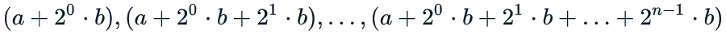

# Loops Solution
## ❓ Task
Given an integer, N, print its first 10 multiples. Should be printed on a new line in the form: N x i = result.
## ⬅️Sample Input 
<pre>
2
</pre>

## ➡️Sample Output
<pre>
2 x 1 = 2
2 x 2 = 4
2 x 3 = 6
2 x 4 = 8
2 x 5 = 10
2 x 6 = 12
2 x 7 = 14
2 x 8 = 16
2 x 9 = 18
2 x 10 = 20
</pre>

# Loops Solution2
## ❓ Task
We use the integers a, b, and n to create the following series:

Constraints:
You are given q queries in the form of a, b, and n. For each query, print the series corresponding to the given a, b, and n values as a single line of n space-separated integers.
## ⬅️Sample Input 
<pre>
2
0 2 10
5 3 5
</pre>

## ➡️Sample Output 
<pre>
2 6 14 30 62 126 254 510 1022 2046
8 14 26 50 98
</pre>